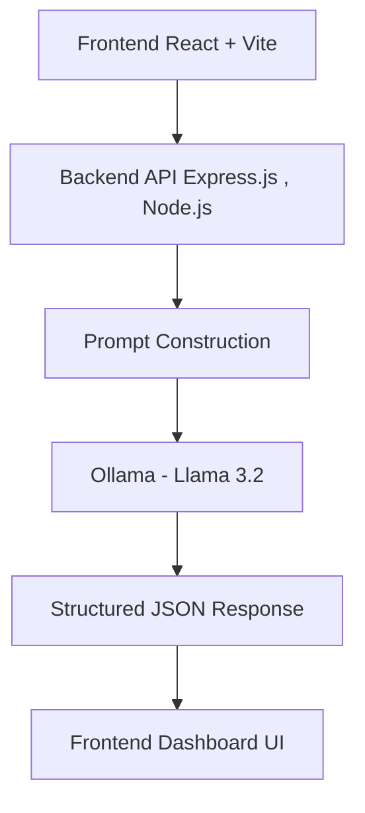

**What is Trinethra?**

Trinethra ("Three Eyes" in Sanskrit) is the management and supervisory layer of PDGMS. It's the view that DeepThought's internal team — TPMs (Technical Program Managers), HR, and psychology interns — uses to monitor Fellow performance across all client engagements.

**Problem Statement**

Supervisor evaluations in fellowship programs are often based on long unstructured transcripts, making the assessment process time-consuming and inconsistent. Evaluators must manually identify evidence, map feedback to rubrics, and determine performance scores, which can lead to inefficiencies and subjective judgment.

This project aims to build an AI-assisted evaluation system that analyzes supervisor transcripts and generates structured insights such as rubric scores, evidence extraction, KPI mapping, gap analysis, and follow-up questions. The system is designed to support human evaluators by improving consistency, reducing manual effort, and increasing transparency in the evaluation process.

# Function

A web application that takes a supervisor transcript as input, runs it through a local LLM (Ollama), and produces a structured analysis that a psychology intern can review, edit, and finalize.

The tool does NOT replace the intern's judgment. It produces a draft analysis that the intern reviews — accepting, rejecting, or editing each finding. The AI suggests; the human decides.

# Setup Instructions
1. Clone the Repository

```git clone https://github.com/CapedCrusader14/trinethra-analyzer.git```

```cd trinethra-analyzer```

2. Install Frontend Dependencies

```cd frontend```
```npm install```

3. Install Backend Dependencies (in a new terminal)

```cd backend```
```npm install```

4. Install Ollama from their official website. here we have used **llama 3.2**

5. Run Ollama

```ollama run llama3.2```

6. Start Backend Server

``` node index.js```

7.Start Frontend Server

```npm run dev```

The application should be up and running in your local system

9. **Usage**
-Paste supervisor transcript

-Click “Run Analysis”

-View:
  Rubric Score
  
  Evidence Extraction
  
  KPI Mapping
  
  Gap Analysis
  
  Follow-up Questions


**ARCHITECTURE OVERVIEW**



# Design Principles

The architecture was designed with focus on:

simplicity

reliability

structured AI output

human-in-the-loop review

modular frontend components

scalable backend orchestration

The system prioritizes transparent evidence-linked evaluation rather than fully automated decision-making.

**Challenges Faced** 

Gap Detection- Identifying meaningful performance gaps from unstructured supervisor transcripts was challenging because feedback is often indirect and context-dependent. The system was designed to extract improvement areas while maintaining alignment with rubric criteria and evaluation context.

Showing Uncertainty- LLM-generated evaluations can sometimes appear overly confident even when information is incomplete or ambiguous. To address this, the interface includes evidence-linked scoring, editable outputs, and a clear human-review warning to encourage evaluator oversight.


# imporovement i would like to make with more time-
Build an evaluation history system so interns can revisit previous transcript analyses and compare performance trends over time.
